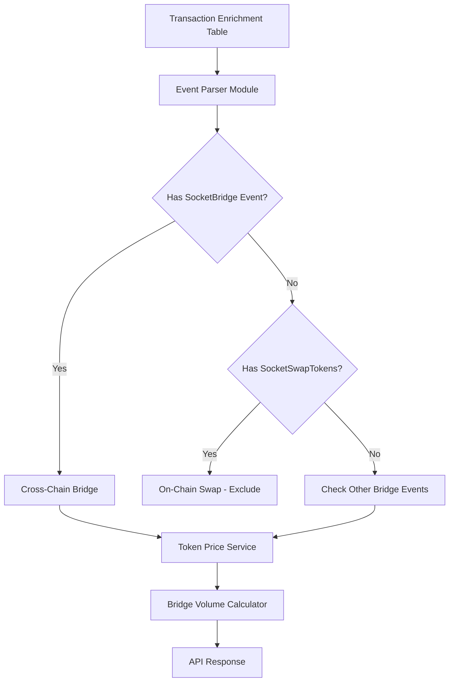

# Design Document: Bridge USD Volume Metrics

## Overview

This design document outlines the architecture and implementation approach for enhancing the bridge volume tracking system to accurately calculate USD volume for all bridge transactions, properly distinguish between on-chain swaps and cross-chain bridges, and support ERC20 token bridges.

## Architecture

The solution involves three main components:

1. **Event Parser Module** - Parses transaction logs to extract bridge-specific events and token transfers
2. **Token Price Service** - Provides USD prices for tokens
3. **Bridge Volume Calculator** - Aggregates and calculates bridge volumes with proper classification



## Components and Interfaces

### 1. Event Signatures and Constants

```typescript
// Event topic signatures
const EVENT_SIGNATURES = {
  // ERC20 Transfer: Transfer(address indexed from, address indexed to, uint256 value)
  ERC20_TRANSFER: '0xddf252ad1be2c89b69c2b068fc378daa952ba7f163c4a11628f55a4df523b3ef',
  
  // Bungee SocketBridge: SocketBridge(uint256 amount, address token, uint256 toChainId, bytes32 bridgeName, address sender, address receiver, bytes32 metadata)
  SOCKET_BRIDGE: '0x74594da9e31ee4068e17809037db37db496702bf7d8d63afe6f97949277d1609',
  
  // Bungee SocketSwapTokens: SocketSwapTokens(address fromToken, address toToken, uint256 buyAmount, uint256 sellAmount, bytes32 routeName, address receiver, bytes32 metadata)
  SOCKET_SWAP_TOKENS: '0xb346a959ba6c0f1c7ba5426b10fd84fe4064e392a0dfcf6609e9640a0dd260d3',
  
  // OFT Events (USDT0)
  OFT_SENT: '0x85496b760a4b7f8d66384b9df21b381f5d1b1e79f229a47aaf4c232edc2fe59a',
  OFT_RECEIVED: '0xefed6d3500546b29533b128a29e3a94d70788727f0507505ac12eaf2e578fd9c',
};

// Known token configurations
const KNOWN_TOKENS: Record<string, { symbol: string; decimals: number; priceType: 'usd' | 'eth' | 'external' }> = {
  '0x4200000000000000000000000000000000000006': { symbol: 'WETH', decimals: 18, priceType: 'eth' },
  '0xeeeeeeeeeeeeeeeeeeeeeeeeeeeeeeeeeeeeeeee': { symbol: 'ETH', decimals: 18, priceType: 'eth' },
  '0x0200c29006150606b650577bbe7b6248f58470c1': { symbol: 'USDT', decimals: 6, priceType: 'usd' },
  '0x2d270e6886d130d724215a266106e6832161eaed': { symbol: 'USDC', decimals: 6, priceType: 'usd' },
  '0xe343167631d89b6ffc58b88d6b7fb0228795491d': { symbol: 'USDG', decimals: 18, priceType: 'usd' },
  '0xfc421ad3c883bf9e7c4f42de845c4e4405799e73': { symbol: 'GHO', decimals: 18, priceType: 'usd' },
  '0xeb466342c4d449bc9f53a865d5cb90586f405215': { symbol: 'axlUSDC', decimals: 6, priceType: 'usd' },
};

// Ink Chain ID
const INK_CHAIN_ID = 57073;
```

### 2. Event Parser Module

```typescript
interface ParsedLog {
  index: number;
  address: string;
  topics: string[];
  data: string;
  event?: string;
}

interface SocketBridgeEvent {
  amount: bigint;
  token: string;
  toChainId: number;
  bridgeName: string;
  sender: string;
  receiver: string;
}

interface SocketSwapTokensEvent {
  fromToken: string;
  toToken: string;
  buyAmount: bigint;
  sellAmount: bigint;
  routeName: string;
  receiver: string;
}

interface ERC20TransferEvent {
  tokenAddress: string;
  from: string;
  to: string;
  amount: bigint;
}

interface TransactionClassification {
  type: 'cross_chain_bridge' | 'on_chain_swap' | 'unknown';
  bridgeEvent?: SocketBridgeEvent;
  swapEvent?: SocketSwapTokensEvent;
  tokenTransfers: ERC20TransferEvent[];
}

class BridgeEventParser {
  /**
   * Parse transaction logs and classify the transaction
   */
  parseTransaction(logs: ParsedLog[], walletAddress: string): TransactionClassification {
    const tokenTransfers = this.parseERC20Transfers(logs);
    const bridgeEvent = this.parseSocketBridgeEvent(logs);
    const swapEvent = this.parseSocketSwapTokensEvent(logs);
    
    // Classification logic
    if (bridgeEvent && bridgeEvent.toChainId !== INK_CHAIN_ID) {
      return { type: 'cross_chain_bridge', bridgeEvent, tokenTransfers };
    }
    
    if (swapEvent && !bridgeEvent) {
      return { type: 'on_chain_swap', swapEvent, tokenTransfers };
    }
    
    return { type: 'unknown', tokenTransfers };
  }
  
  /**
   * Parse SocketBridge event from logs
   */
  parseSocketBridgeEvent(logs: ParsedLog[]): SocketBridgeEvent | null {
    for (const log of logs) {
      if (log.topics[0]?.toLowerCase() === EVENT_SIGNATURES.SOCKET_BRIDGE.toLowerCase()) {
        return this.decodeSocketBridgeData(log.data);
      }
    }
    return null;
  }
  
  /**
   * Parse SocketSwapTokens event from logs
   */
  parseSocketSwapTokensEvent(logs: ParsedLog[]): SocketSwapTokensEvent | null {
    for (const log of logs) {
      if (log.topics[0]?.toLowerCase() === EVENT_SIGNATURES.SOCKET_SWAP_TOKENS.toLowerCase()) {
        return this.decodeSocketSwapTokensData(log.data);
      }
    }
    return null;
  }
  
  /**
   * Parse all ERC20 Transfer events from logs
   */
  parseERC20Transfers(logs: ParsedLog[]): ERC20TransferEvent[] {
    const transfers: ERC20TransferEvent[] = [];
    
    for (const log of logs) {
      if (log.topics[0]?.toLowerCase() === EVENT_SIGNATURES.ERC20_TRANSFER.toLowerCase()) {
        const from = this.extractAddressFromTopic(log.topics[1]);
        const to = this.extractAddressFromTopic(log.topics[2]);
        const amount = BigInt(log.data);
        
        transfers.push({
          tokenAddress: log.address.toLowerCase(),
          from,
          to,
          amount,
        });
      }
    }
    
    return transfers;
  }
  
  /**
   * Decode SocketSwapTokens event data
   * Data layout: fromToken (32) | toToken (32) | buyAmount (32) | sellAmount (32) | routeName (32) | receiver (32) | metadata (32)
   */
  private decodeSocketSwapTokensData(data: string): SocketSwapTokensEvent {
    const cleanData = data.startsWith('0x') ? data.slice(2) : data;
    
    return {
      fromToken: '0x' + cleanData.slice(24, 64).toLowerCase(),
      toToken: '0x' + cleanData.slice(88, 128).toLowerCase(),
      buyAmount: BigInt('0x' + cleanData.slice(128, 192)),
      sellAmount: BigInt('0x' + cleanData.slice(192, 256)),
      routeName: '0x' + cleanData.slice(256, 320),
      receiver: '0x' + cleanData.slice(344, 384).toLowerCase(),
    };
  }
  
  /**
   * Decode SocketBridge event data
   */
  private decodeSocketBridgeData(data: string): SocketBridgeEvent {
    const cleanData = data.startsWith('0x') ? data.slice(2) : data;
    
    return {
      amount: BigInt('0x' + cleanData.slice(0, 64)),
      token: '0x' + cleanData.slice(88, 128).toLowerCase(),
      toChainId: Number(BigInt('0x' + cleanData.slice(128, 192))),
      bridgeName: '0x' + cleanData.slice(192, 256),
      sender: '0x' + cleanData.slice(280, 320).toLowerCase(),
      receiver: '0x' + cleanData.slice(344, 384).toLowerCase(),
    };
  }
  
  private extractAddressFromTopic(topic: string): string {
    const cleanTopic = topic.startsWith('0x') ? topic.slice(2) : topic;
    return '0x' + cleanTopic.slice(-40).toLowerCase();
  }
}
```

### 3. Token Price Service

```typescript
interface TokenPriceResult {
  priceUsd: number;
  decimals: number;
  source: 'known_stablecoin' | 'eth_price' | 'external' | 'fallback';
}

class TokenPriceService {
  private ethPrice: number = 3500;
  
  async setEthPrice(price: number): Promise<void> {
    this.ethPrice = price;
  }
  
  /**
   * Get USD price for a token
   */
  async getTokenPrice(tokenAddress: string): Promise<TokenPriceResult> {
    const addr = tokenAddress.toLowerCase();
    const knownToken = KNOWN_TOKENS[addr];
    
    if (knownToken) {
      if (knownToken.priceType === 'usd') {
        return { priceUsd: 1.0, decimals: knownToken.decimals, source: 'known_stablecoin' };
      }
      if (knownToken.priceType === 'eth') {
        return { priceUsd: this.ethPrice, decimals: knownToken.decimals, source: 'eth_price' };
      }
    }
    
    // For unknown tokens, try to get price from external source or use fallback
    // In production, this could query DexScreener, CoinGecko, or on-chain DEX prices
    return { priceUsd: 0, decimals: 18, source: 'fallback' };
  }
  
  /**
   * Calculate USD value for a token amount
   */
  async calculateUsdValue(tokenAddress: string, amount: bigint): Promise<number> {
    const { priceUsd, decimals } = await this.getTokenPrice(tokenAddress);
    const tokenAmount = Number(amount) / Math.pow(10, decimals);
    return tokenAmount * priceUsd;
  }
}
```

### 4. Bridge Volume Calculator

```typescript
interface BridgeTransactionResult {
  isBridge: boolean;
  direction: 'in' | 'out' | null;
  usdValue: number;
  ethValue: number;
  tokenAddress: string | null;
  tokenAmount: bigint | null;
}

class BridgeVolumeCalculator {
  private parser: BridgeEventParser;
  private priceService: TokenPriceService;
  
  constructor() {
    this.parser = new BridgeEventParser();
    this.priceService = new TokenPriceService();
  }
  
  /**
   * Process a Bungee Socket Gateway transaction
   */
  async processBungeeTransaction(
    logs: ParsedLog[],
    operations: Operation[],
    walletAddress: string,
    ethPrice: number
  ): Promise<BridgeTransactionResult> {
    await this.priceService.setEthPrice(ethPrice);
    
    const classification = this.parser.parseTransaction(logs, walletAddress);
    
    // Exclude on-chain swaps from bridge volume
    if (classification.type === 'on_chain_swap') {
      return { isBridge: false, direction: null, usdValue: 0, ethValue: 0, tokenAddress: null, tokenAmount: null };
    }
    
    // Process cross-chain bridge
    if (classification.type === 'cross_chain_bridge' && classification.bridgeEvent) {
      const { token, amount, sender, receiver } = classification.bridgeEvent;
      const direction = sender.toLowerCase() === walletAddress ? 'out' : 'in';
      const usdValue = await this.priceService.calculateUsdValue(token, amount);
      const ethValue = token.toLowerCase() === KNOWN_TOKENS['0x4200000000000000000000000000000000000006']?.symbol ? 
        Number(amount) / 1e18 : 0;
      
      return { isBridge: true, direction, usdValue, ethValue, tokenAddress: token, tokenAmount: amount };
    }
    
    // Fallback: analyze token transfers for bridge detection
    return this.analyzeTokenTransfersForBridge(classification.tokenTransfers, walletAddress, operations, ethPrice);
  }
  
  /**
   * Analyze token transfers to detect bridge activity when no explicit bridge event exists
   */
  private async analyzeTokenTransfersForBridge(
    transfers: ERC20TransferEvent[],
    walletAddress: string,
    operations: Operation[],
    ethPrice: number
  ): Promise<BridgeTransactionResult> {
    // Find transfers involving the user's wallet
    const userReceived = transfers.filter(t => t.to.toLowerCase() === walletAddress);
    const userSent = transfers.filter(t => t.from.toLowerCase() === walletAddress);
    
    // Check operations for ETH transfers to user (bridge IN)
    const ethReceived = operations.find(op => 
      op.to?.id?.toLowerCase() === walletAddress && 
      op.value && BigInt(op.value) > 0n
    );
    
    if (ethReceived) {
      const ethValue = Number(BigInt(ethReceived.value)) / 1e18;
      return {
        isBridge: true,
        direction: 'in',
        usdValue: ethValue * ethPrice,
        ethValue,
        tokenAddress: '0xeeeeeeeeeeeeeeeeeeeeeeeeeeeeeeeeeeeeeeee',
        tokenAmount: BigInt(ethReceived.value),
      };
    }
    
    // Check for token transfers to user (bridge IN)
    if (userReceived.length > 0) {
      const primaryTransfer = userReceived[userReceived.length - 1]; // Last transfer is usually the final one
      const usdValue = await this.priceService.calculateUsdValue(primaryTransfer.tokenAddress, primaryTransfer.amount);
      
      return {
        isBridge: true,
        direction: 'in',
        usdValue,
        ethValue: 0,
        tokenAddress: primaryTransfer.tokenAddress,
        tokenAmount: primaryTransfer.amount,
      };
    }
    
    return { isBridge: false, direction: null, usdValue: 0, ethValue: 0, tokenAddress: null, tokenAmount: null };
  }
}
```

## Data Models

### Updated Transaction Enrichment Schema

The existing `transaction_enrichment` table already has the necessary columns. We'll utilize:

```sql
-- Existing columns to be populated
tokens_in_raw       JSONB,    -- Array of {token_address, amount, decimals, usd_value}
tokens_out_raw      JSONB,    -- Array of {token_address, amount, decimals, usd_value}
tokens_in_usd_total NUMERIC,  -- Pre-calculated total USD value of tokens received
tokens_out_usd_total NUMERIC, -- Pre-calculated total USD value of tokens sent
```

### Token Transfer JSON Structure

```typescript
interface TokenTransferRecord {
  token_address: string;
  symbol?: string;
  amount: string;        // Raw amount as string to preserve precision
  decimals: number;
  usd_value: number;
  price_source: 'known_stablecoin' | 'eth_price' | 'external' | 'fallback';
}
```

## Error Handling

1. **Missing Logs**: If transaction logs are null or empty, fall back to using `eth_value_decimal` and `value` fields
2. **Unknown Token**: If token is not in known list and external price unavailable, use 0 USD value but still count the transaction
3. **Parse Errors**: Log errors and continue processing other transactions; don't fail the entire request
4. **Rate Limiting**: Implement caching for token prices to avoid excessive external API calls

## Testing Strategy

1. **Unit Tests**:
   - Event parsing functions with known event data
   - Token price calculation with various token types
   - Transaction classification logic

2. **Integration Tests**:
   - End-to-end bridge volume calculation with real transaction data
   - API response format validation

3. **Test Cases**:
   - Cross-chain ETH bridge (IN and OUT)
   - Cross-chain ERC20 bridge (stablecoins, other tokens)
   - On-chain swap (should be excluded)
   - Mixed transaction (swap + bridge)
   - Unknown token bridge

## Implementation Notes

### Performance Considerations

1. **Batch Processing**: When enriching transactions, process in batches to reduce database round trips
2. **Price Caching**: Cache token prices for 5 minutes to reduce external API calls
3. **Pre-calculation**: Store parsed token data in `tokens_in_raw`/`tokens_out_raw` during enrichment to avoid re-parsing on every query

### Migration Path

1. Add new parsing logic to the bridge volume API endpoint
2. Update enrichment service to populate `tokens_in_raw`, `tokens_out_raw`, and USD totals
3. Backfill existing transactions with parsed token data (optional, can be done incrementally)

### Backward Compatibility

- Existing ETH-based bridge calculations remain unchanged
- New token parsing is additive; if parsing fails, fall back to existing logic
- API response format remains the same, just with more accurate values
