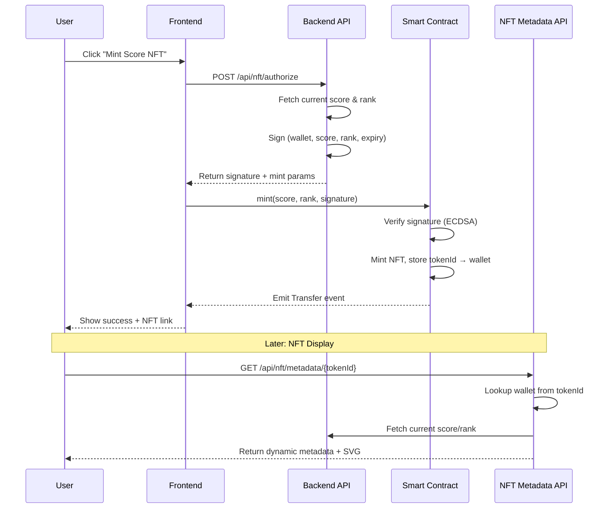

# Design Document: Dynamic NFT Minting

## Overview

This design document outlines the architecture and implementation details for the Dynamic NFT Minting feature in InkScore. The feature enables users to mint ERC-721 NFTs that dynamically display their wallet's score and rank. The system uses a backend-signed authorization model to ensure score integrity, with dynamic metadata served via API endpoints.

## Architecture



## Components and Interfaces

### 1. Smart Contract (InkScoreNFT.sol)

**Location:** `contracts/InkScoreNFT.sol`

```solidity
// SPDX-License-Identifier: MIT
pragma solidity ^0.8.20;

import "@openzeppelin/contracts/token/ERC721/ERC721.sol";
import "@openzeppelin/contracts/access/Ownable.sol";
import "@openzeppelin/contracts/utils/cryptography/ECDSA.sol";
import "@openzeppelin/contracts/utils/cryptography/MessageHashUtils.sol";

contract InkScoreNFT is ERC721, Ownable {
    using ECDSA for bytes32;
    using MessageHashUtils for bytes32;

    uint256 private _nextTokenId;
    string private _baseTokenURI;
    address public authorizedSigner;
    
    // tokenId => wallet address that owns the score
    mapping(uint256 => address) public tokenWallet;
    // wallet => tokenId (for checking if wallet already minted)
    mapping(address => uint256) public walletToken;
    // Used signatures to prevent replay
    mapping(bytes32 => bool) public usedSignatures;

    event ScoreNFTMinted(address indexed wallet, uint256 indexed tokenId, uint256 score, string rank);

    constructor(
        string memory baseURI,
        address _authorizedSigner
    ) ERC721("InkScore Achievement", "INKSCORE") Ownable(msg.sender) {
        _baseTokenURI = baseURI;
        authorizedSigner = _authorizedSigner;
        _nextTokenId = 1;
    }

    function mint(
        uint256 score,
        string calldata rank,
        uint256 expiry,
        bytes calldata signature
    ) external returns (uint256) {
        require(block.timestamp <= expiry, "Signature expired");
        
        bytes32 messageHash = keccak256(abi.encodePacked(
            msg.sender,
            score,
            rank,
            expiry
        ));
        
        require(!usedSignatures[messageHash], "Signature already used");
        
        bytes32 ethSignedHash = messageHash.toEthSignedMessageHash();
        address signer = ethSignedHash.recover(signature);
        require(signer == authorizedSigner, "Invalid signature");
        
        usedSignatures[messageHash] = true;
        
        // If wallet already has an NFT, burn it first
        if (walletToken[msg.sender] != 0) {
            uint256 oldTokenId = walletToken[msg.sender];
            _burn(oldTokenId);
            delete tokenWallet[oldTokenId];
        }
        
        uint256 tokenId = _nextTokenId++;
        _safeMint(msg.sender, tokenId);
        tokenWallet[tokenId] = msg.sender;
        walletToken[msg.sender] = tokenId;
        
        emit ScoreNFTMinted(msg.sender, tokenId, score, rank);
        
        return tokenId;
    }

    function tokenURI(uint256 tokenId) public view override returns (string memory) {
        _requireOwned(tokenId);
        return string(abi.encodePacked(_baseTokenURI, "/api/nft/metadata/", _toString(tokenId)));
    }

    function setBaseURI(string calldata baseURI) external onlyOwner {
        _baseTokenURI = baseURI;
    }

    function setAuthorizedSigner(address _signer) external onlyOwner {
        authorizedSigner = _signer;
    }

    function _toString(uint256 value) internal pure returns (string memory) {
        if (value == 0) return "0";
        uint256 temp = value;
        uint256 digits;
        while (temp != 0) {
            digits++;
            temp /= 10;
        }
        bytes memory buffer = new bytes(digits);
        while (value != 0) {
            digits -= 1;
            buffer[digits] = bytes1(uint8(48 + uint256(value % 10)));
            value /= 10;
        }
        return string(buffer);
    }
}
```

### 2. Backend Authorization API

**Location:** `app/api/nft/authorize/route.ts`

```typescript
interface MintAuthorizationRequest {
  walletAddress: string;
}

interface MintAuthorizationResponse {
  signature: string;
  score: number;
  rank: string;
  expiry: number;
  walletAddress: string;
}
```

**Flow:**
1. Receive wallet address from frontend
2. Fetch current score and rank from `pointsService.calculateWalletScore()`
3. Create message hash: `keccak256(wallet, score, rank, expiry)`
4. Sign with server private key (stored in `NFT_SIGNER_PRIVATE_KEY` env var)
5. Return signature and mint parameters

### 3. NFT Metadata API

**Location:** `app/api/nft/metadata/[tokenId]/route.ts`

```typescript
interface NFTMetadata {
  name: string;
  description: string;
  image: string;  // Data URI or hosted URL
  external_url: string;
  attributes: Array<{
    trait_type: string;
    value: string | number;
  }>;
}
```

**Response Example:**
```json
{
  "name": "InkScore #42",
  "description": "Dynamic achievement NFT representing wallet score on InkScore",
  "image": "data:image/svg+xml;base64,...",
  "external_url": "https://inkscore.xyz/wallet/0x...",
  "attributes": [
    { "trait_type": "Score", "value": 1250 },
    { "trait_type": "Rank", "value": "Power User" },
    { "trait_type": "Wallet", "value": "0x1234...abcd" }
  ]
}
```

### 4. SVG Image Generator

**Location:** `lib/services/nft-image-service.ts`

Generates dynamic SVG images with:
- InkScore branding and gradient background
- Large score number display
- Rank badge with tier-specific colors
- Abbreviated wallet address
- Timestamp of last update

```typescript
interface SVGGeneratorParams {
  score: number;
  rank: string;
  rankColor: string;
  walletAddress: string;
}

function generateScoreNFTSvg(params: SVGGeneratorParams): string
```

### 5. Frontend Components

**Location:** `app/components/MintScoreNFT.tsx`

```typescript
interface MintScoreNFTProps {
  walletAddress: string;
  currentScore: number;
  currentRank: string;
  rankColor: string;
}
```

**States:**
- `idle`: Show mint button
- `authorizing`: Fetching signature from backend
- `confirming`: Waiting for user to confirm in wallet
- `minting`: Transaction submitted, waiting for confirmation
- `success`: NFT minted successfully
- `error`: Display error message with retry option

## Data Models

### Database: NFT Mints Tracking (Optional)

```sql
CREATE TABLE nft_mints (
  id SERIAL PRIMARY KEY,
  wallet_address VARCHAR(42) NOT NULL,
  token_id INTEGER NOT NULL,
  score_at_mint INTEGER NOT NULL,
  rank_at_mint VARCHAR(50) NOT NULL,
  tx_hash VARCHAR(66) NOT NULL,
  minted_at TIMESTAMP DEFAULT NOW(),
  UNIQUE(wallet_address)
);
```

### Contract Storage

| Mapping | Key | Value | Purpose |
|---------|-----|-------|---------|
| `tokenWallet` | tokenId | wallet address | Lookup wallet for metadata |
| `walletToken` | wallet address | tokenId | Check if wallet has NFT |
| `usedSignatures` | signature hash | bool | Prevent replay attacks |

## Error Handling

### Smart Contract Errors

| Error | Condition | User Message |
|-------|-----------|--------------|
| `Signature expired` | `block.timestamp > expiry` | "Authorization expired. Please try again." |
| `Invalid signature` | Signer mismatch | "Invalid authorization. Please refresh and retry." |
| `Signature already used` | Replay attempt | "This authorization was already used." |

### API Errors

| Status | Condition | Response |
|--------|-----------|----------|
| 400 | Invalid wallet address | `{ error: "Invalid wallet address format" }` |
| 404 | Token ID not found | `{ error: "NFT not found" }` |
| 500 | Score calculation failed | `{ error: "Failed to fetch score data" }` |

### Frontend Error States

- Network errors: Show retry button with "Network error. Please check your connection."
- User rejection: Show "Transaction cancelled" with option to retry
- Insufficient gas: Show "Insufficient funds for gas" with current balance

## Testing Strategy

### Unit Tests

1. **SVG Generator Tests**
   - Verify SVG output contains correct score/rank values
   - Test edge cases: very large scores, special characters in rank names
   - Validate SVG is well-formed XML

2. **Authorization Service Tests**
   - Verify signature generation with known test vectors
   - Test expiry timestamp calculation
   - Verify signature verification matches contract logic

### Integration Tests

1. **Metadata API Tests**
   - Test valid tokenId returns correct metadata structure
   - Test invalid tokenId returns 404
   - Verify metadata updates when score changes

2. **Authorization Flow Tests**
   - Test full flow from request to signature
   - Verify signature can be verified by contract

### Contract Tests (Hardhat/Foundry)

1. **Minting Tests**
   - Test successful mint with valid signature
   - Test rejection of expired signatures
   - Test rejection of invalid signatures
   - Test re-minting (burn old, mint new)

2. **Access Control Tests**
   - Test only owner can change signer
   - Test only owner can change base URI

## Security Considerations

1. **Private Key Management**
   - Store `NFT_SIGNER_PRIVATE_KEY` in secure environment variables
   - Use separate signing key from deployment key
   - Consider using AWS KMS or similar for production

2. **Signature Replay Prevention**
   - Include expiry timestamp in signed message
   - Track used signatures on-chain
   - 5-minute expiry window balances UX and security

3. **Rate Limiting**
   - Implement rate limiting on `/api/nft/authorize` endpoint
   - Prevent spam minting attempts

4. **Input Validation**
   - Validate wallet address format on all endpoints
   - Sanitize any user input in SVG generation
